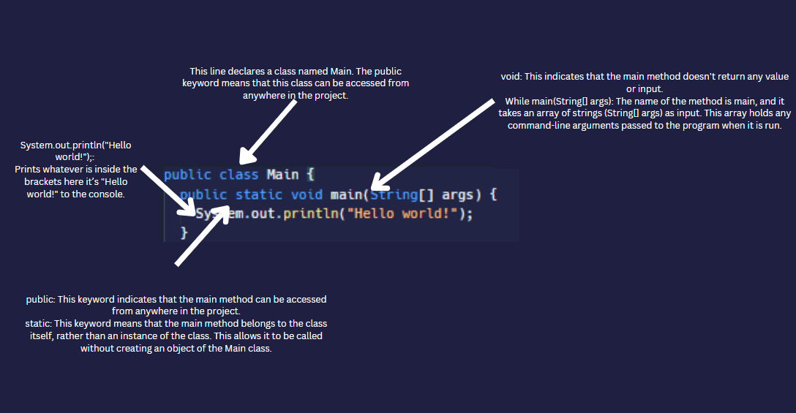

# Our first statement

## Print Statements
You just learned your first command: the `print` statement. It says "Print out whatever's in my brackets".
The `print` statement is how you get your program to put messages in the console.





- System.out.println();: Prints whatever is inside the brackets here it’s the string "Hello world!" to the console.
- The `""` (quotes) are used to tell the command that you're putting *text* or a string in there (any text you want)

## Multiple Print Statements


👉 Here is what muliple `println` statements looks like. Copy this code public static void main(String[] args) { and }.

```java
System.out.println("Hello Bro!");
System.out.println("Hi world!");
System.out.println("Hello Dude!");
```

&nbsp;

### You are on your way to being a coder in no time!
